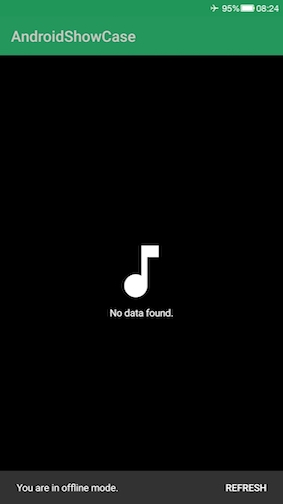

# AndroidShowCase

The app uses a free music [API](https://www.last.fm/api). It has two main modules:

- App: view layer
- Datasource: data layer

It is based on:

- SOLID principles
- common android best practices from the official android documentation

I've chosen the following [Code Styles](https://github.com/square/java-code-styles/).

### Offline Capabilities

I implemented a simple mechanism to support offline Capabilities.
The logic is [DBDelegate.kt](app/src/main/java/ciriti/androidshowcase/core/components/DBDelegate.kt).
As the name suggests, to add this feature, I used [class delegation](https://kotlinlang.org/docs/reference/delegation.html) feature from Kotlin
to implement the [Decorator Pattern](https://en.wikipedia.org/wiki/Decorator_pattern).

[DBDelegate.kt](app/src/main/java/ciriti/androidshowcase/core/components/DBDelegate.kt)
stores the json of the tracks list inside Shared Preferences.

Of course with the same technique ([class delegation](https://kotlinlang.org/docs/reference/delegation.html)),
it is possible to create different implementations using others mechanisms
to store the data.

Additionally, the database structure follows the
[Open-Close principle](https://en.wikipedia.org/wiki/Open%E2%80%93closed_principle),
which provides an interface and a default implementation. The class I provide is
**final** but it leaves you the option of creating your own implementation to
use it in the application - without causing crash.

This approach makes the application maintainable and scalable. It also makes
easy to test as you can see in [DBDelegateTest.kt](app/src/androidTest/java/ciriti/androidshowcase/core/components/DBDelegateTest.kt)

#### Use case

Below the use cases which I implemented.
To make the offline mode more effective I decided to insert a timestamp
on the top-right corner of each element.
It will be updated every time you fetch data from the network.

#### 1. The application is connected

In this case, you will be able to get the home page as follows.

Every time you will swipe to refresh the data, the timestamp will be
updated with the last info.

#### 2.1 Connection is not connected but data are already present.

In this case, you will get a message in the snackbar which will advise you
that **You are in offline mode**.

Every time you will swipe to refresh the data, the timestamp won't be
updated with the last timestamp.

#### 2.2 Connection is not connected but data are NOT present.

In this case, the application will visualize a placeholder in the middle of the page
and also the snackbar.

### Architectural pattern:

- MVVM

### Language:

- kotlin

### Used libraries:

- RxJava
- Retrofit 2
- Glide
- Dagger 2
- canary leaks
- Android Architecture Components

### Test libraries:

- Espresso
- Mockito
- JUnit

